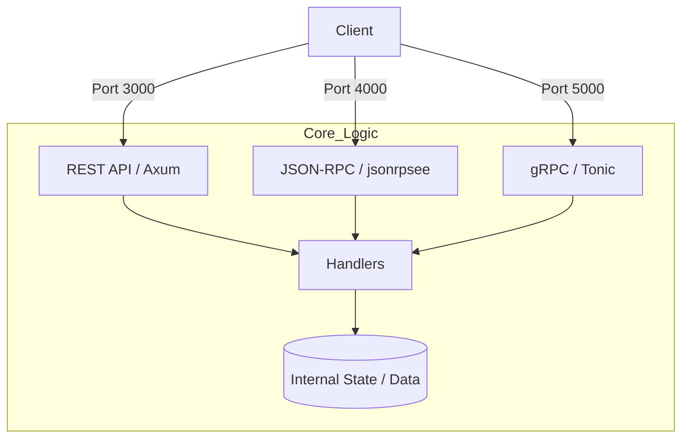

# OmniGate (omni-gate-rs)

**OmniGate** is a high-performance, multi-protocol gateway server built with **Rust**. It demonstrates how to orchestrate multiple communication standards within a single process, sharing underlying business logic across **REST**, **JSON-RPC**, and **gRPC** interfaces.

## Key Features

- **Triple-Protocol Stack**:
  - **REST API** (Port 3000): Powered by **Axum**, perfect for standard web integrations and CRUD operations.
  - **JSON-RPC 2.0** (Port 4000): Powered by **jsonrpsee**, supporting both HTTP and WebSocket-based subscriptions.
  - **gRPC** (Port 5000): Powered by **Tonic** (HTTP/2), optimized for high-performance microservice communication.
- **Real-time Subscriptions**: Native support for live data streams via **JSON-RPC WebSockets** and **gRPC Server Streaming**.
- **Modular Architecture**: Complete decoupling of protocol-specific routing (`routes/`) from core business logic (`handlers/`).
- **Production Ready**: Includes health checks, OpenAPI/Swagger documentation, TOML-based configuration, and structured logging with `tracing`.
- **Async Power**: Fully driven by the **Tokio** runtime for maximum concurrency and efficiency.

---

## Architecture

The project is designed to ensure that requests from any protocol are funneled into unified handlers, ensuring "write once, serve everywhere" logic.



---

## Project Structure

```
omni-gate-rs/
├── src/
│   ├── main.rs          # Entry point: spawns concurrent server tasks
│   ├── server.rs        # Server orchestration & multi-tasking setup
│   ├── config.rs        # TOML configuration parsing
│   ├── routes/          # Protocol-specific routing
│   │   ├── rest.rs      # REST endpoints
│   │   ├── json_rpc.rs  # JSON-RPC method registration
│   │   └── health.rs    # Health check endpoints
│   ├── handlers/        # Core business logic (Protocol-agnostic)
│   │   ├── grid.rs      # Grid data management
│   │   ├── user_info.rs # User profile logic
│   │   └── grpc_*.rs    # gRPC service implementations
│   ├── protos/          # Generated code from Protobuf
│   └── errors.rs        # Centralized error handling
├── protos/              # .proto definition files
├── examples/            # Client examples (WS & gRPC Stream)
└── Cargo.toml           # Dependency management
```

---

## Quick Start

### 1. Run the Server

Ensure you have the Rust toolchain installed, then run:

```bash
cargo run
```

The server will simultaneously listen on ports 3000 (REST), 4000 (JSON-RPC), and 5000 (gRPC).

---

## API Call Guide

### 1. REST API (Port 3000)

| Method | Path      | Function               |
| ------ | --------- | ---------------------- |
| GET    | `/grid`   | Fetch all grid data    |
| POST   | `/grid`   | Create a new grid item |
| GET    | `/health` | Health check           |

**Example**:

```bash
curl -X GET http://localhost:3000/grid
```

### 2. JSON-RPC 2.0 (Port 4000)

Supports standard JSON-RPC 2.0 requests and WebSocket subscriptions.

**Request Example**:

```bash
curl -X POST http://localhost:4000 \
  -H "Content-Type: application/json" \
  -d '{"jsonrpc":"2.0","method":"get_user_info","params":{},"id":1}'
```

**WebSocket Subscription**:

Connect to `ws://localhost:4000` or run the example client:

```bash
cargo run --example test_jsonrpc_ws
```

### 3. gRPC (Port 5000)

Includes `GreeterService` and `UserService`.

**Example (using grpcurl)**:

```bash
# Call Greeter service
grpcurl -plaintext -d '{"name":"Omni"}' localhost:5000 helloworld.Greeter/SayHello

# Subscribe to user updates (Streaming)
grpcurl -plaintext -d '{"user_id":1,"interval_seconds":2}' localhost:5000 user.UserService/SubscribeUserUpdates
```

---

## Subscription Comparison

| Feature            | JSON-RPC (WebSocket)                  | gRPC (Streaming)                             |
| ------------------ | ------------------------------------- | -------------------------------------------- |
| **Transport**      | WebSocket (Text/JSON)                 | HTTP/2 (Binary/Protobuf)                     |
| **Best For**       | Web Frontends, Browser clients        | Backend Services, Mobile Apps                |
| **Client Example** | `cargo run --example test_jsonrpc_ws` | `cargo run --example test_grpc_subscription` |

---

## Configuration

Modify the gateway behavior via `config.toml`:

```toml
[server]
rest_host = "127.0.0.1"
rest_port = 3000
jsonrpc_port = 4000
grpc_port = 5000

[logging]
level = "info"  # trace, debug, info, warn, error
```

---

## Technology Stack

- **Runtime**: Tokio
- **Web Framework**: Axum (REST only)
- **gRPC**: Tonic
- **JSON-RPC**: jsonrpsee
- **Serialization**: Serde, Prost
- **Docs**: Utoipa (Swagger UI)

## License

This project is licensed under the Apache License 2.0.
